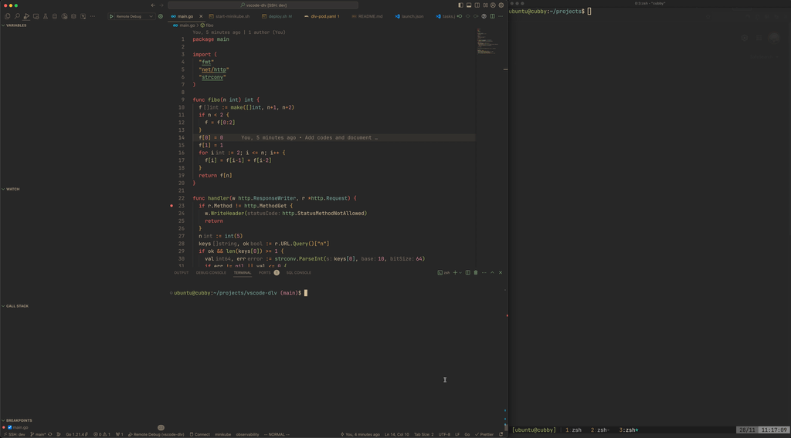

# VSCode dlv

A demonstrate for debugging in Kubernetes by leveraging go-dlv and VSCode.



### Notes

- This repository demonstrates a PoC structure to debug a go application inside a container running in Kubernetes.
- In my opinion, this method is not recommended due to its complexity and slowness, which might impede your development speed. However, if your application must run inside a Kubernetes cluster and you have no alternatives, this method can be used. Otherwise, I advise against it.
- This approach is not limited to Kubernetes. You can adapt the [deploy.sh](./deploy.sh) script to make it work with `docker``.

## Background

Recently, I've been conducting integration tests with my eBPF tool (Kubernetes Native), requiring connection with the Container Runtime in the Kubernetes cluster and `root` capability for deploying eBPF code into the Kernel space.

If my tool only required a Container Runtime endpoint, it would be simple to achieve. I would start `minikube` with specific mount options (as root and in the `/var/run` directory. And don't wasting your time with the `/run` directory).

However, `minikube` (with `qemu` driver) does not share its processes with the host machine, leaving the host machine's Kernel unaware of these processes.

Therefore, I decided to deploy my code to `minikube` and take actions to enable debugging within it.

## The Idea

Most Golang applications use [go-delve/delve (dlv)](https://github.com/go-delve/delve) for debugging.

`dlv` offers many powerful features, including **Remote Debugging**, which allows debugging applications from a different machine.

The process involves packaging my code and dlv into a Docker image and deploying it to Kubernetes. However, this approach is somewhat slow. Updating your code requires rebuilding it, downloading and installing the dlv binary, loading your new image into minikube's registry, and waiting for Kubernetes to roll out your workload. This can take up to 3 minutes, depending on your application.

To optimize this process, avoid including your app in the image.

Your image will be built and loaded only once. Your application binary will be copied into minikube via `minikube cp``. The final step is to recreate your pod. For details, please refer to [deploy.sh](./deploy.sh).

## Integrate with VSCode

Integrating with VSCode is the final step to complete this demonstration.

```json
// .vscode/tasks.json
{
  "version": "2.0.0",
  "tasks": [
    {
      "label": "pre-remote-debug",
      "type": "shell",
      "command": "${workspaceFolder}/deploy.sh"
    }
  ]
}

// .vscode/launch.json
{
  "configurations": [
    {
      "name": "Remote Debug",
      "type": "go",
      "request": "attach",
      "mode": "remote",
      // Change this to localhost if you don't have telepresence
      "host": "remote-debug.default.svc.cluster.local",
      "port": 40000,
      "debugAdapter": "dlv-dap",
      // This task will trigger the deploy script each time
      // you use the 'Run and Debug' function.
      "preLaunchTask": "pre-remote-debug"
    }
  ]
}
```

Each time you hit the `Run and Debug` button, VSCode will first trigger the `pre-remote-debug` task and then attach to the dlv pod.

The `pre-remote-debug` task essentially triggers the `deploy.sh` script.

## Limitation

- As mentioned in the Notes section, this method is complex, slow, and may slow down your development velocity.
- When using local debugging in VSCode, the output appears in the `DEBUG CONSOLE` tab. However, with this method, the debug output will show in the output console of the dlv pod.

## eBPF

If you're curious about the library I use for my eBPF tool, here it is: [https://github.com/vietanhduong/go-bpf](https://github.com/vietanhduong/go-bpf). Contributions are welcome.
